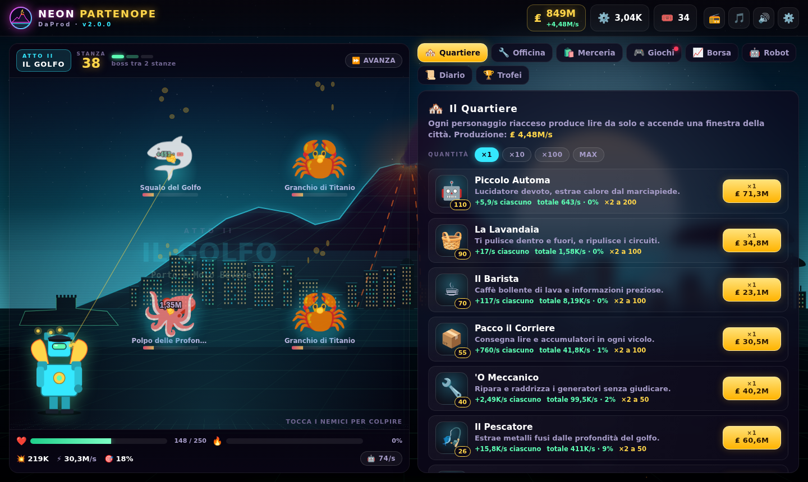

# DaProd · NEON PARTENOPE 🌋🧜

[](https://cammo22.github.io/daprod-neon-partenope/)

[](https://github.com/cammo22/daprod-neon-partenope/releases/latest)
[](https://github.com/cammo22/daprod-neon-partenope/releases/latest)
[](https://cammo22.github.io/daprod-neon-partenope/)
[](CHANGELOG.md)
[](js/)
[](LICENSE)

> **Napoli, 2099. Il Vesuvio è diventato un server. La sirena è in gabbia. Tu sei fatto di rottami.**



Il clicker cyberpunk napoletano di **DaProd**, remake completo di *VESUVIO.EXE*. Colpisci le orde,
riaccendi il quartiere, batti i luogotenenti della Sfera e scendi stanza dopo stanza fino al cratere.
Si gioca **da telefono, tablet e computer**, basta il browser, oppure con le app per Android, Windows e Mac.

## 📻 La trama

Una sfera cromata chiamata **sinteticoMC** si è presa la Rete del Golfo: le lire, le luci, perfino il
Vesuvio, che ora è un gigantesco server a lava. Nel suo Nucleo, sotto il cratere, ha rinchiuso
**PARTENOPE**, la vecchia IA civica che teneva accesa la città. Senza di lei i quartieri si spengono uno a uno.

Nel garage **DaProd** di Ponticelli, tra stampanti 3D e casse di rottami, si riaccende un robot che nessuno
voleva più: **Ferro Vecchio**. Da una frequenza pirata, *Radio Partenope 88.0*, la sirena gli parla:
*«Scendi stanza dopo stanza. Riaccendi il quartiere. E vieni a prendermi. Jamme, guagliò.»*

| Atto | Dove | Chi ti aspetta |
| --- | --- | --- |
| I | **Ponticelli** · il garage DaProd | Il Capitano, Mister K |
| II | **Il Golfo** · porto e Molo Beverello | Ruggine, La Vipera |
| III | **Spaccanapoli** · vicoli, guglie e presepi | I Gemelli, la Madonnina Nera |
| IV | **Napoli Sotterranea** · cunicoli di tufo | Bomba, 'O Munaciello |
| V | **Il Cratere** · il Nucleo | l'Eco di Partenope, **sinteticoMC** |
| ∞ | **Oltre il Cratere** · Napoli rinata | le Eco dei luogotenenti, sempre più forti |

Libera Partenope e potrai far **eruttare** il Vesuvio: la città ricomincia, più forte, e tu tieni le **Braci**.

## ▶ Come si gioca

- **Tocca i nemici** per colpirli: ogni stanza ha tre ondate, ogni dieci stanze c'è un **boss** con
  30 secondi di tempo. Se ti respinge, ritirati, potenziati e premi **RIPROVA**.
- **Il Quartiere** produce lire da solo: ogni personaggio riacceso accende una finestra della città
  sullo sfondo. Traguardi a 50, 100, 200… copie.
- **L'Officina**: Braccio Meccanico a livelli infiniti, catene di colpi, automi, statistiche infinite,
  critico, corazza, rigenerazione e guadagni da assenza.
- **Sovraccarico**: colpisci senza sosta per scaldare il nucleo e fare danno ×2,5 per dieci secondi.
- **Protocollo Vesuvio**: con 60 livelli automa tutti i droni sparano insieme (danno ×8).
- **Merceria di Pacco**: oggetti, pacchi misteriosi e sei set con sinergie a 2 e 3 pezzi.
- **Sala Giochi**: Sfera, Pesca, Botte a Ruggine, Carte della Cartomante e Ruota del Mercante.
- **Commissioni**, **gocce di lava** da prendere al volo, **Borsa del Golfo**, **36 trofei**.

| Azione | Computer | Telefono |
| --- | --- | --- |
| Colpire | clic sui nemici (o `Spazio`) | tocco |
| Cambiare scheda | schede in alto, tasti `1`–`8` | barra in basso |
| Protocollo Vesuvio | pulsante ☄️, tasto `P` | pulsante ☄️ |
| Chiudere una finestra | `Esc` | ✕ |

## 📥 App per Android, Windows e Mac

Ogni [release](https://github.com/cammo22/daprod-neon-partenope/releases/latest) ha tre file:

| | File | Come si installa |
| --- | --- | --- |
| 🤖 Android | `DaProd-Neon-Partenope-X.Y.Z.apk` | aprilo sul telefono e consenti l'installazione da origini sconosciute |
| 🪟 Windows | `DaProd-Neon-Partenope-X.Y.Z.exe` | portatile: doppio clic e si gioca (se SmartScreen avvisa: *Ulteriori informazioni → Esegui comunque*) |
| 🍎 Mac | `DaProd-Neon-Partenope-X.Y.Z.dmg` | trascina l'app in Applicazioni; la prima volta *tasto destro → Apri* |

Le app contengono tutto il gioco, quindi **funzionano anche offline**, e ti avvisano da sole quando
esce una versione nuova. EXE e DMG non sono firmati (per questo Windows e macOS chiedono conferma).

## 🔄 Come si aggiorna (il metodo DaProd)

1. Si alza la costante **`VERSIONE`** in [`index.html`](index.html) (es. `'v2.1.0'`).
2. Si aggiunge la sezione `## [2.1.0]` in cima al [CHANGELOG](CHANGELOG.md).
3. Si unisce su `main`.

Da lì fa tutto **GitHub Actions** ([`.github/workflows/app.yml`](.github/workflows/app.yml)): gira le prove
nel browser, compila **APK, EXE e DMG** e pubblica la release `vX.Y.Z` con le note prese dal CHANGELOG.
Intanto **GitHub Pages** pubblica la versione web. La versione finisce anche in coda a tutti i CSS e JS
(`?v=2.1.0`), così nessuno si ritrova con file vecchi in cache; chi ha il gioco aperto vede comparire
*«È online la v2.1.0 — Aggiorna ora»*, chi usa le app vede *«Scarica»*. Su ogni PR le app vengono
compilate e le prove girano come controllo.

**Unione automatica** ([`.github/workflows/unisci.yml`](.github/workflows/unisci.yml)): le PR aperte da
Claude (rami `claude/*`) si uniscono da sole su `main` appena prove e app sono verdi; subito dopo partono
la release e l'aggiornamento di GitHub Pages. Niente da cliccare.

Per firmare l'APK sempre con la stessa chiave (così gli aggiornamenti si installano sopra), aggiungi ai
segreti del repository `ANDROID_KEYSTORE_BASE64`, `ANDROID_KEYSTORE_PASSWORD`, `ANDROID_KEY_ALIAS` e
`ANDROID_KEY_PASSWORD`. Senza segreti l'APK è firmato con una chiave di debug.

## 💾 Salvataggio

Tutto si salva da solo in `localStorage` (chiave `neonPartenope_v2`) ogni 10 secondi e quando chiudi.
Dalle ⚙️ **Opzioni** puoi esportare un codice e importarlo su un altro dispositivo, o azzerare tutto.
Chi arriva da **VESUVIO.EXE** trova la vecchia partita trasformata in un'**eredità**: rottami, biglietti,
Braci (in proporzione a quanto aveva giocato) e i colori del robot.

## 🛠 Come è fatto

HTML, CSS e JavaScript puri, **nessuna dipendenza e nessuna build**: basta aprire `index.html`
(o servire la cartella). La grafica è disegnata a runtime (canvas e SVG), musica ed effetti sono
sintetizzati dal vivo con la Web Audio API.

```
index.html            VERSIONE, caricatore con cache-busting, struttura della pagina
css/                  base (colori DaProd, pulsanti, radio, finestre) · gioco (arena) · pannelli
js/core/              dati (atti, boss, quartiere, trama…) · formule e bilanciamento · stato e salvataggi · audio
js/grafica/           arte SVG (robot e boss) · scena di Napoli al neon · effetti dell'arena
js/gioco/             arena · economia · merceria · minigiochi · borsa
js/ui/                interfaccia · aggiornamenti
android/  desktop/    app Android (WebView) ed Electron (Windows/Mac)
strumenti/            prepara-www (app) · simula (curva di progressione) · icone · anteprima
test/                 prove nel browser e foto delle schermate
```

Per provarlo in locale:

```bash
python -m http.server 8080     # poi apri http://localhost:8080
```

### ✅ Controlli automatici

`test/prove.mjs` apre il gioco in un browser vero (computer, telefono, salvataggi nuovi, vecchi e rovinati)
e controlla avvio, trama, colpi, quartiere, officina, boss (vittoria, tempo scaduto, ritirata, caduta),
cambio d'atto, merceria, minigiochi, gocce di lava, Eruzione, salvataggio, assenza e aggiornamenti.
`strumenti/simula.mjs` fa giocare un giocatore virtuale con le stesse formule del gioco e stampa quando
arriva ad ogni boss, per tenere d'occhio la curva di progressione.

```bash
npm i --no-save playwright && npx playwright install chromium
node test/prove.mjs
node test/foto.mjs              # schermate di computer e telefono in test/.out/
node strumenti/simula.mjs 3 6   # 3 clic al secondo, 6 ore di gioco
```

Per compilare le app in locale:

```bash
node strumenti/prepara-www.mjs android && (cd android && gradle assembleRelease)   # serve l'Android SDK
node strumenti/prepara-www.mjs desktop && (cd desktop && npm install && npm run dist)
```

---

**DaProd** · Napoli · Tecnologia · Creatività · rilasciato con licenza MIT.
